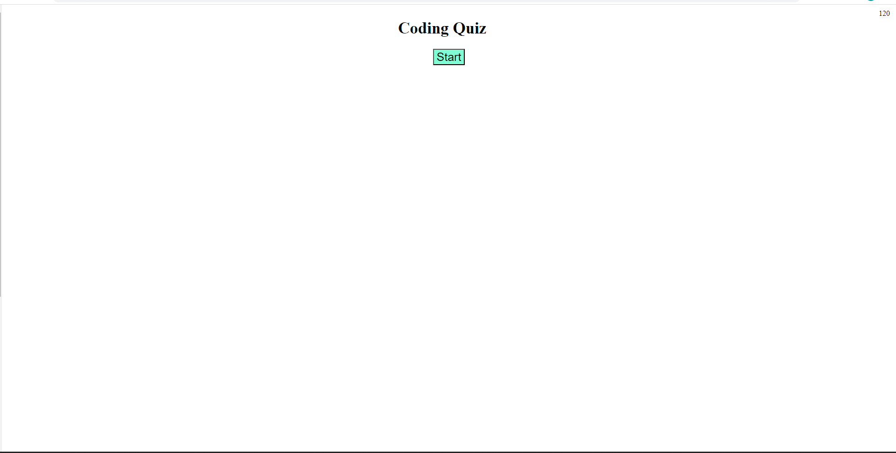
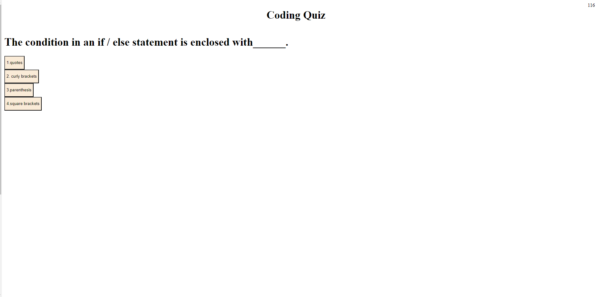
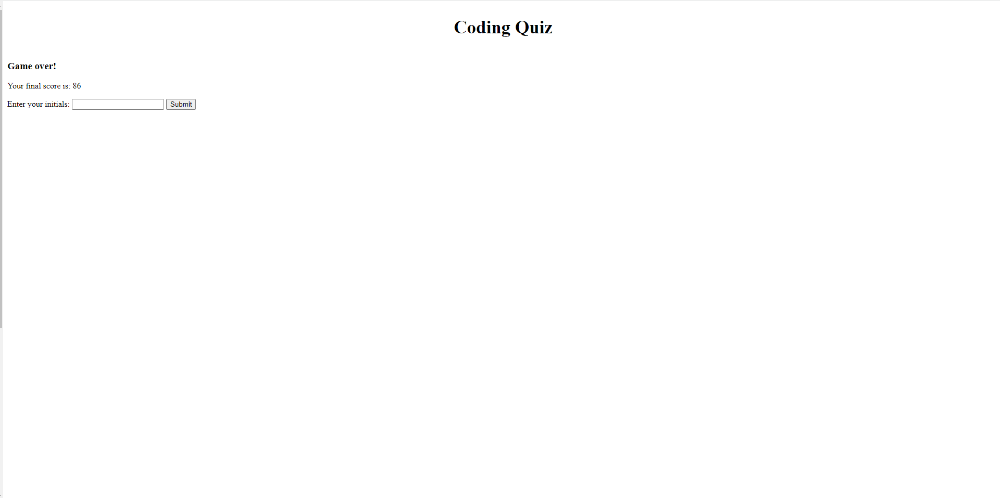

# Homework #4

## Description

- My motivation was to make a little progress in learning everyday.
- This project would help me sharpen my Javascript skills and learn what i didn't know.
- It solved that when the button is clicked, i should haved targeted that specific one instead of whole things.
- I learned how to display question and next questions when buttons are clicked, results show up after clicking the button, and how to save it to Local Storage.

## Usage

- Click button to start.
- Select answer to see if they are right or wrong.
- Score will show up once answers are all selected.
- Enter intials and click 'submit' to save it to Local Storage.

# Credits

- NA

# License

MIT License

Copyright (c) [2023] [Kin Ho]

Permission is hereby granted, free of charge, to any person obtaining a copy
of this software and associated documentation files (the "Software"), to deal
in the Software without restriction, including without limitation the rights
to use, copy, modify, merge, publish, distribute, sublicense, and/or sell
copies of the Software, and to permit persons to whom the Software is
furnished to do so, subject to the following conditions:

The above copyright notice and this permission notice shall be included in all
copies or substantial portions of the Software.

THE SOFTWARE IS PROVIDED "AS IS", WITHOUT WARRANTY OF ANY KIND, EXPRESS OR
IMPLIED, INCLUDING BUT NOT LIMITED TO THE WARRANTIES OF MERCHANTABILITY,
FITNESS FOR A PARTICULAR PURPOSE AND NONINFRINGEMENT. IN NO EVENT SHALL THE
AUTHORS OR COPYRIGHT HOLDERS BE LIABLE FOR ANY CLAIM, DAMAGES OR OTHER
LIABILITY, WHETHER IN AN ACTION OF CONTRACT, TORT OR OTHERWISE, ARISING FROM,
OUT OF OR IN CO

